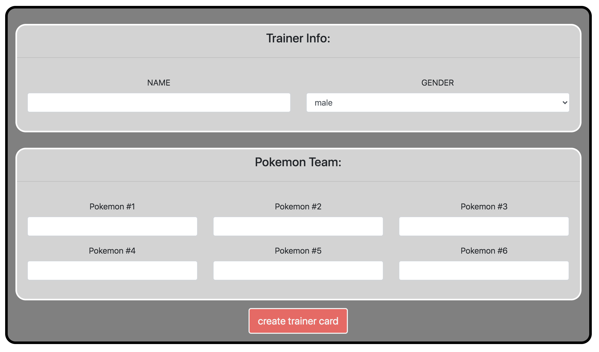
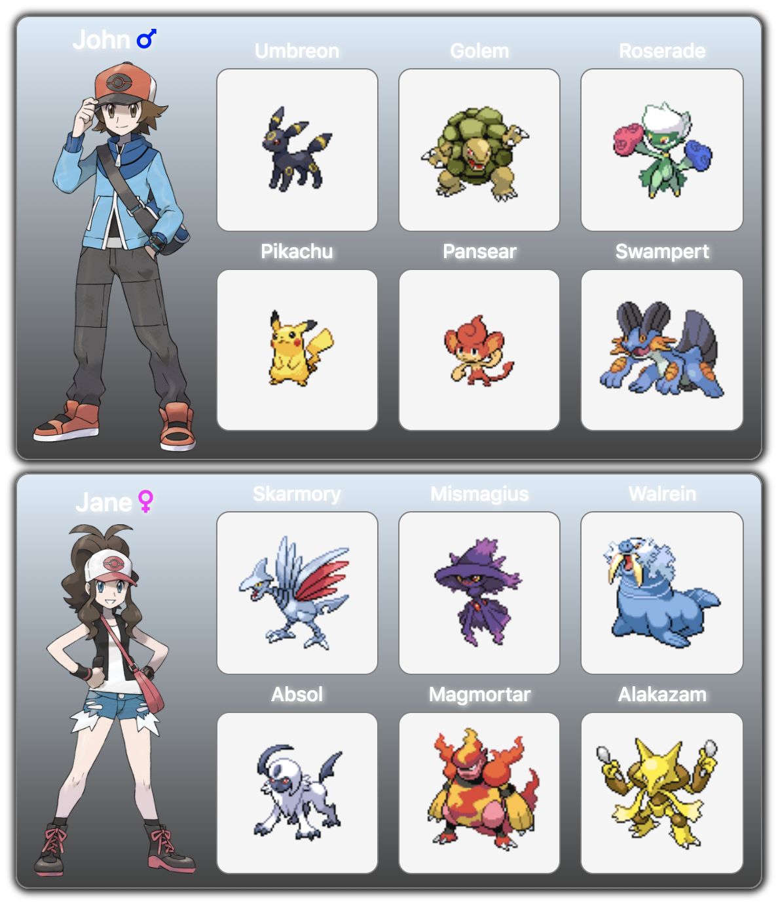

# PokemonTrainerCardGenerator
     

---

## Description:
This is an app that demonstrates Object-Oriented Programming (OOP); it allows the user to input name, gender, and the names of 6 Pokemon to create their very own Trainer Card.

---

## Table of Contents:
* [Installation](#installation)
* [Usage](#usage)
* [Resources](#resources)
* [Questions](#questions)

---

## Installation:
No installation is required, just [open the application](https://craindavis.github.io/PokemonTrainerCardGenerator/) in your browser.

---

## Usage:
* fill in your name and select your gender
* input the names of 6 Pokemon
    * generations 1 through 8 are all possible

* click the button to generate your very own Trainer Card
* you can generate as many as you want!

---

## Resources:
* [Bootstrap CSS](https://getbootstrap.com/)
* [PokeAPI](https://pokeapi.co/)

---

## Questions: 
For any questions, please contact:

 

__[CrainDavis](https://github.com/CrainDavis)__ at chyna.davis11@gmail.com
